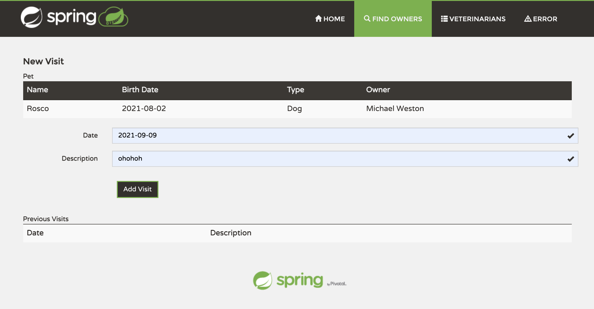

# sfg-pet-clinic

A classical pet clinic web project for online study.

#Modules
##Data Module (backend)
###Dependencies 
| name | version |
|:---:|:---:|
|Spring Data JPA | 2.5.2 |
|H2 Database | 1.4.200 |
|Lombok | 1.18.20 }

###Components
    PATH = pet-clinic-data/src/main/java/.../
| component name | description |
| :---: | :---: |
| model | basic model classes for web application |
| repositories | repositories extends from CrudRepository (org.springframework.data.repository) which has database opertaion methods |
| services | backend service methods using repositories to operate database |

##Web Module (frontend)
###Dependencies
| name | version |
|:---:|:---:|
| pet-clinic-data | 0.0.1 |
| Thymeleaf | 2.5.2 |
| Spring Web | 2.5.2 |
| Spring Boot Actuator | 2.5.2 |
| webjars-locator-core | 0.46 |
| webjars/jquery | 2.2.4 |
| webjars/jquery-ui | 1.11.4 |
| webjars/bootstrap | 3.3.6 |
###Component
    PATH = pet-clinic-web/src/main/java/.../
| component name | description |
| :---: | :---: |
| controllers | web page routing controllers，which do functions by calling services in data module |
| formatters | implement Formatter<T> for input format |
| bootstrap | initially load some data |

##Previews
####Owner Searching Page

####Owner Information Page

####Adding a Visit

####After Adding
